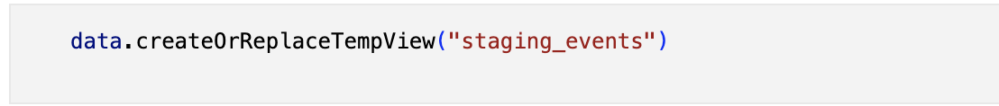

# Instruction

1. Run คำสั่งด้านล่างเพื่อใช้ในการสร้างไฟล์จาก Jupyter Lab 
```sh
sudo chmod 777 .
```

2. Run คำสั่งด้านล่างเพื่อให้ Jupyter Notebook Access ผ่าน Port 8888 ได้
```sh
docker-compose up
```

3. โดยจะนำข้อมูลที่ใช้อยู่ใน folder data และข้อมูลที่จะใช้ในการ Test จะใช้ data จากไฟล์ github_events_01.json


4. จากนั้นใช้ฟังก์ชั่น data.createOrReplaceTempView("staging_events") เพื่อให้ Spark สามารถใช้ Coding ด้วย SQL ได้


5. หลังจากนั้นจะเก็บข้อมูลให้อยู่ในรุปแบบของตารางที่แบ่งข้อมูลออกเป็น Partition โดยใช้ SQL ให้สอดคล้องกับ Data model และทำการสร้าง Folder เพื่อใช้จัดเก็บไฟล์


6. ข้อมูลจะถูกจัดเก็บใน Folder โดยแบ่งข้อมูลออกเป็นหลายๆส่วน ในตัวอย่างเป็นข้อมูล events ถูกแบ่งเป็นไฟล์ 2 ไฟล์
