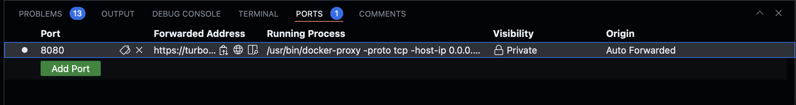
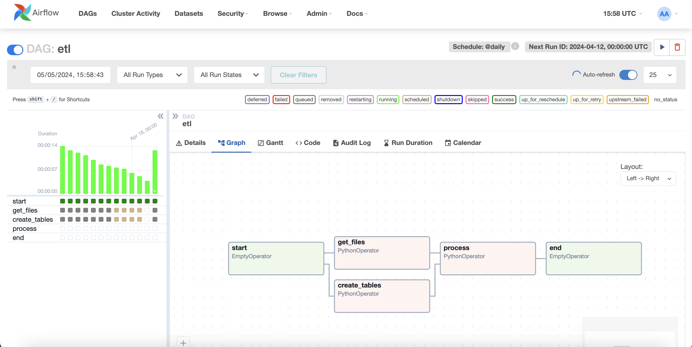

# Instruction

1. Run file docker เพื่อใช้ airflow 
```sh
curl -LfO 'https://airflow.apache.org/docs/apache-airflow/2.9.0/docker-compose.yaml'
```

2. สร้าง Folder dags, logs, plugins และ config เพื่อใช้ในการเก็บข้อมูลระหว่างการทำงานใน airflow
```sh
mkdir -p ./dags ./logs ./plugins ./config
echo -e "AIRFLOW_UID=$(id -u)" > .env
```

3. สร้าง web server airflow ด้วย docker port 8080 
```sh
docker compose up
```


4. จัดการfile etl.py เพื่อใช้ในการ Load File, Create Tables และ Process การทำงาน

start >> [get_files, create_tables] >> process airflow >> end



#Shutdown steps
5. Run คำสั่งต่อไปนี้ 
```sh
Ctrl C
docker compose down
```
