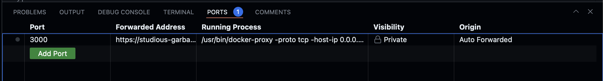
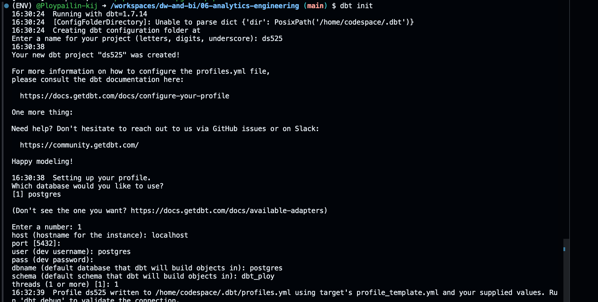
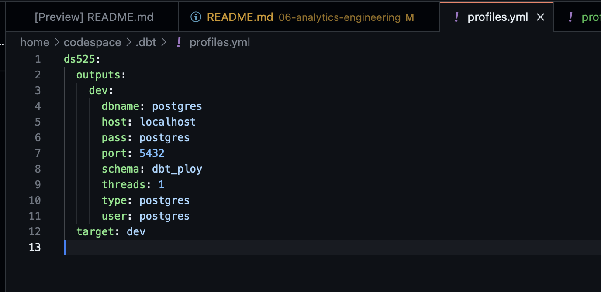

# Instruction

1. เข้าไปที่ path ของ folder 06-analytics-engineering
```sh
cd 06-analytics-engineering
```
1. สร้าง web server postgres ด้วย docker port 3000
```sh
docker compose up
```



2. สร้าง ENV สำหรับการเขียน code Python และเก็บ package
```sh
python -m venv ENV
```

3. run คำสั่ง Activate ENV
```sh
source ENV/bin/activate
```

4. Install package สำหรับใช้งาน dbt และ postgres
```sh
pip install dbt-core dbt-postgres
```

5. สร้างระบบฐานข้อมูลใน postgres และสร้าง profiles project ชื่อ ds525
```sh
dbt init
```


6. เราสามารถนำสิ่งที่เรา Set มาทำ profiles project โดยการนำ code มาสร้าง file profiles.yml
```sh
code /home/codespace/.dbt/profiles.yml
```

7. ทดสอบ debug connection ของ postgres แต่ต้อง Run บน path ของ folder ds525
```sh
cd ds525
dbt debug
```

8. Run คำสั่งด้านล่างเพื่อเอาข้อมูลขึ้นบน postgres จะใช้ข้อมูลจาก ds525/models .sql โดยใช้ dbt_project.yml  ในการกำหนดโครงสร้าง tables และ view 
```sh
dbt run
```


11. Run คำสั่ง test เพื่อเช็ค data quality
```sh
dbt test
```

#Shutdown steps
12. ปิดการทำงาน docker
```sh
docker compose down
```

13. ออกจาก ENV
```sh
deactivate
```

